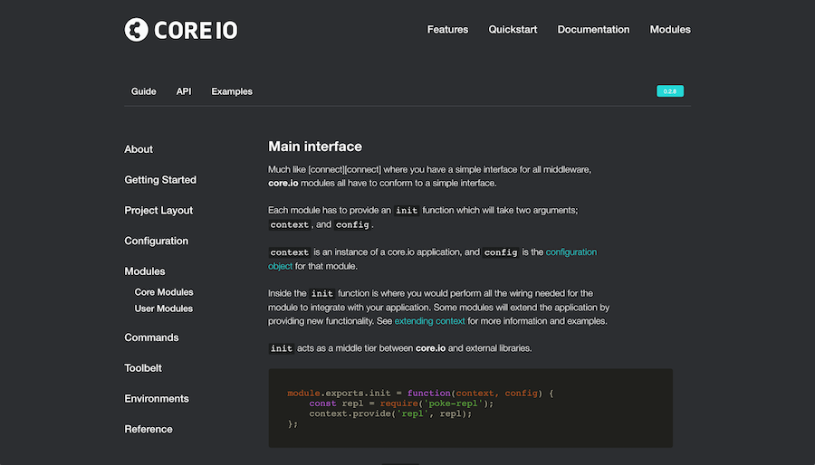

## core.io Theme for documentation.js


This is a theme for [documentationjs](https://github.com/documentationjs/documentation).



### Usage

```
$ npm install --save-dev documentation-theme-core.io
$ npm install -g documentation
```

Then use the theme to build your docs:

```
$ documentation serve --format html --theme node_modules/documentation-theme-core.io
```

### Development

To build:

    $ npm run build

To build and watch:

    $ npm run watch

